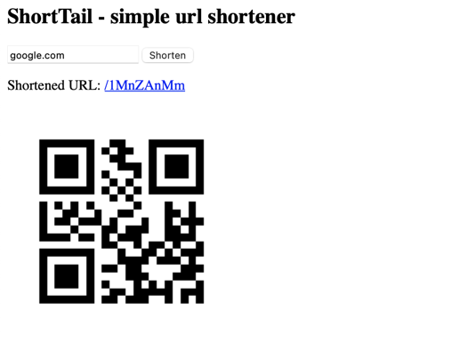

## ShortTail - simple url shortener
build on: golang, badger-db, json-rpc, prometheus, grafana

---

first copy .env

    cp .env.dist .env

run app:

    make run

run env, if u want see metrics:

    make env

---
UI is available at http://localhost:8080/, metrics at http://localhost:3000 (admin, admin)

